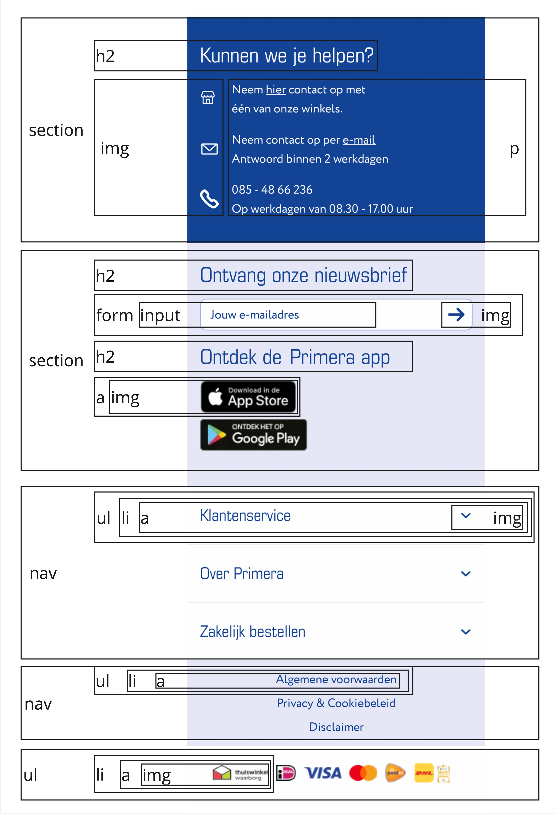

# Procesverslag
Markdown is een simpele manier om HTML te schrijven.  
Markdown cheat cheet: [Hulp bij het schrijven van Markdown](https://github.com/adam-p/markdown-here/wiki/Markdown-Cheatsheet).

Nb. De standaardstructuur en de spartaanse opmaak van de README.md zijn helemaal prima. Het gaat om de inhoud van je procesverslag. Besteedt de tijd voor pracht en praal aan je website.

Nb. Door *open* toe te voegen aan een *details* element kun je deze standaard open zetten. Fijn om dat steeds voor de relevante stuk(ken) te doen.

## Jij

  
uitwerken voor kick-off werkgroep

  ### Auteur:
  Jared Penner

  #### Je startniveau:
  blauw

  #### Je focus:
  responsive
 

## Je website

  
uitwerken voor kick-off werkgroep

  ### Je opdracht:
  https://www.primera.nl/

  #### Screenshot(s) van de eerste pagina (small screen): 
  Home pagina  
  

  #### Screenshot(s) van de tweede pagina (small screen):
  Cadeaubox cadeaukaart met tony chocolonely  
  
 

## Toegankelijkheidstest 1/2 (week 1)

  
uitwerken na test in 2e werkgroep

  ### Bevindingen
  Lijst met je bevindingen die in de test naar voren kwamen:

  * De HTML code heeft veel errors.
  * De lijsten in de code zijn niet correct.
  * De buttons worden aangesproken met een span.
  * Support geen dark mode.
  * Kan de text grootte niet aanpassen.
  * De inlog knop wordt door de screenreeder niet erkend.

  <a href="readme-images/wcag_check_primera.pdf">Ingevulde WCAG checklist over de site van Primera.</a>

## Breakdownschets (week 1)

  
uitwerken na afloop 3e werkgroep

  ### de hele pagina: 
  

  ### de header: 
  

  ### de main: 
   
  

  ### de footer: 
  

  ### dynamisch deel (bijv menu): <!-- deze nog doen --> 
  

  ### wellicht nog een dynamisch deel (bijv filter): 
  

## Voortgang 1 (week 2)

  
uitwerken voor 1e voortgang

  ### Stand van zaken

  De content van de website in html zetten ging goed met behulp van de breakdown schets. De opdrachten waren handig om kennis weer een beetje op te halen. Verder heb ik de opdrachten opgeslagen zodat ik het later weer kan gebruiken. Nu ik alle content heb ben ik van boven naar beneden bezig met het stijlen van de pagina.

  Het ophalen van de afbeeldingen uit de Primera website lukte niet. De afbeeldingen stonden binnen de before en dan in de css maar kunnen nu wel opgehaald worden. Verder had ik nog wat vragen over de transities. Dit kan veelal met css opgelost worden. Het secondaire menu kan met translate verwijderen en verschijnen.

  

  ### Agenda voor meeting
  samen met je groepje opstellen

  | Jared                                                           | student 2          | student 3    | student 4        |
  | ---                                                             | ---                | ---          | ---              |
  | Kan een afbeelding in een form?                                 | ...                | ...          |                  |
  | Kan ik het doorklikken in het menu ook met een transitie doen?  | ...                | ...          | ...              |
  | Hoe kan ik deze afbeeldingen van de site halen?                 | ...                | ...          | ...              |
  | Het geanimeerde in de header, is dat met een list?              | ...                | ...          | ...              |

  ### Verslag van meeting

  - De readme is goed ingevuld
  - De code ziet er netjes uit
  - Je kan een afbeelding zeker in de form zetten
  - Net zoals je het menu laat verschijnen kan je ook een secundair menu verschijnen en verwijderen
  - De afbeeldingen staan binnen een before en in de css, hieruit kan je ze halen
  - Ja het geanimeerde kan je doen met een list en dan met translate en animate kan je het laten animeren
  - Ik ben goed op weg

## Voortgang 2 (week 3)

  
uitwerken voor 2e voortgang

  ### Stand van zaken
  Ik wilde dat de tekst en de knop in de grid op dezelfde hoogtte zaten dus gebruikte ik hiervoor align-items maar er veranderde niks.

  
  

  Dus had ik hulp gevraagd aan Demi die me als tip gaf om gebruik te maken van grid-area. Dit omdat deze code ervoor zorgt dat ik de elementen in de grid kan verplaatsen.

  
  

   
  Om een icoontje in de zoekbalk te krijgen heb ik gebruikt gemaakt van een backgroundimage. Ik probeerde het eerst in de input te krijgen met flexbox maar dit werkte niet handig. Dus had ik opgezocht hoe anderen dit doen en kwam ik terecht bij Stackoverflow waar ik zag dat iemand het met een background image deed.

  
  

   
  Verder probeerde ik in de navigatie de tekst onder de icoontjes te zetten met flexbox. Maar ook de icons naast elkaar te zetten. Hiervoor gebruikte ik flex-direction column maar dan werden mijn icons verplaatst naar het midden en uitgerekt.

  
  
  

  ### Agenda voor meeting
  samen met je groepje opstellen

  | student 1      | student 2          | student 3    | student 4        |
  | ---            | ---                | ---          | ---              |
  | dit bespreken  | en dit             | en ik dit    | en dan ik dat    |
  | en dat ook nog | dit als er tijd is | nog een punt | dit wil ik zeker |
  | ...            | ...                | ...          | ...              |

  ### Verslag van meeting
  hier na afloop snel de uitkomsten van de meeting vastleggen

  - punt 1
  - punt 2
  - nog een punt
- ...

## Toegankelijkheidstest 2/2 (week 4)

  
uitwerken na test in 9e werkgroep

  ### Bevindingen
  Lijst met je bevindingen die in de test naar voren kwamen (geef ook aan wat er verbeterd is):

## Voortgang 3 (week 4)

  
uitwerken voor 3e voortgang

  ### Stand van zaken
  hier dit ging goed & dit was lastig (neem ook screenshots op van delen van je website en code)

  ### Agenda voor meeting
  samen met je groepje opstellen

  | student 1      | student 2          | student 3    | student 4        |
  | ---            | ---                | ---          | ---              |
  | dit bespreken  | en dit             | en ik dit    | en dan ik dat    |
  | en dat ook nog | dit als er tijd is | nog een punt | dit wil ik zeker |
  | ...            | ...                | ...          | ...              |

  ### Verslag van meeting
  hier na afloop snel de uitkomsten van de meeting vastleggen

  - punt 1
  - punt 2
  - nog een punt
  - ...

## Eindgesprek (week 5)

  
uitwerken voor eindgesprek

  ### Je uitkomst - karakteristiek screenshots:
  

  ### Dit ging goed/Heb ik geleerd: 
  Korte omschrijving met plaatjes

  

  ### Dit was lastig/Is niet gelukt:
  Korte omschrijving met plaatjes

  

## Bronnenlijst

  
continu bijhouden terwijl je werkt

  Nb. Wees specifiek ('css-tricks' als bron is bijv. niet specifiek genoeg). 
  Nb. ChatGpT en andere AI horen er ook bij.
  Nb. Vermeld de bronnen ook in je code.

  1. https://css-tricks.com/almanac/properties/f/flex-direction/ over flex-direction
  2. https://stackoverflow.com/questions/63179896/displaying-an-image-in-search-bar-html over image in form
  3. ...

